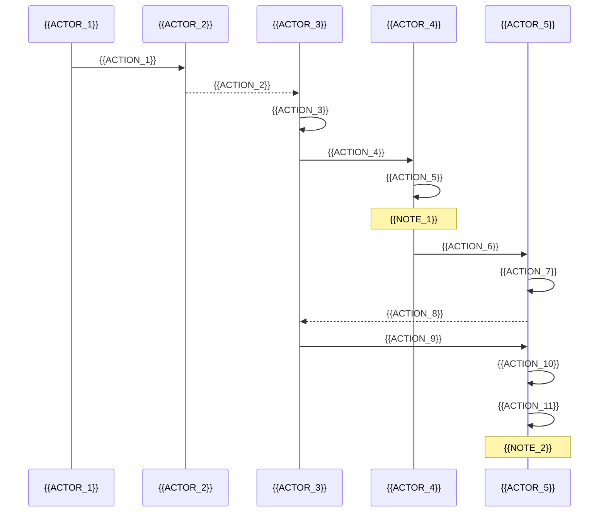

# {{PROJECT_ID}} 错误分析报告


---

## 📋 报告元数据

| 项目 | 内容 |
|------|------|
| **项目编号** | {{PROJECT_ID}} |
| **公司** | {{COMPANY_NAME}} |
| **分析人员** | {{ANALYST_NAME}} |
| **报告日期** | {{REPORT_DATE}} |
| **影响系统** | {{AFFECTED_SYSTEMS}} |
| **优先级** | {{PRIORITY_DESCRIPTION}} |

---

## 🎯 错误概述

**状态**: {{STATUS_EMOJI}} {{STATUS_LEVEL}}
**类型**: {{ERROR_TYPE_FULL}}
**优先级**: {{PRIORITY_FULL_DESC}}

### 问题描述

{{PROBLEM_DESCRIPTION}}

主要影响：
- ✗ {{IMPACT_1}}
- ✗ {{IMPACT_2}}
- ✗ {{IMPACT_3}}
- ✗ {{IMPACT_4}}

### 影响范围

| 影响维度 | 详细说明 |
|---------|---------|
| **功能影响** | {{FUNCTIONAL_IMPACT}} |
| **影响组件** | {{AFFECTED_COMPONENTS}} |
| **影响用户** | {{AFFECTED_USERS}} |
| **业务影响** | {{BUSINESS_IMPACT}} |

### 发现时间与频率

- **首次发现**: {{DISCOVERY_DATE}}
- **发生频率**: {{OCCURRENCE_FREQUENCY}}
- **环境**: {{AFFECTED_ENVIRONMENTS}}

---

## 🔍 技术分析

### 根本原因

{{ROOT_CAUSE_SUMMARY}}

1. **{{ROOT_CAUSE_1_TITLE}}**：{{ROOT_CAUSE_1_DESC}}
2. **{{ROOT_CAUSE_2_TITLE}}**：{{ROOT_CAUSE_2_DESC}}

```mermaid
graph TD
    A[{{FLOW_START}}] --> B{{{FLOW_DECISION}}}
    B -->|{{FLOW_PATH_1}}| C[{{FLOW_NODE_1}}]
    C --> D[{{FLOW_NODE_2}}]
    D --> E[{{FLOW_NODE_3}}]
    E --> F[{{FLOW_NODE_4}}]
    F --> G{{{FLOW_DECISION_2}}}
    G -->|{{FLOW_PATH_2}}| H[{{FLOW_NODE_5}}]
    H --> I[{{FLOW_NODE_6}}]
    I --> J[{{FLOW_NODE_7}}]
    J --> K[{{FLOW_NODE_8}}]
    K --> L[{{FLOW_NODE_9}}]
    L --> M[{{FLOW_END}}]

    style C fill:#ff6b6b
    style H fill:#ff6b6b
    style M fill:#dc143c
```

---

## 🐛 错误详情

### 1. {{ERROR_SECTION_1_TITLE}}

#### 问题代码位置

**文件**: `{{ERROR_FILE_1}}`

```{{CODE_LANGUAGE_1}}
{{ERROR_CODE_SAMPLE_1}}
```

#### 预期实现（缺失部分）

```{{CODE_LANGUAGE_2}}
{{EXPECTED_CODE_SAMPLE_1}}
```

**分析结论**:
- {{ANALYSIS_CONCLUSION_1}}
- {{ANALYSIS_CONCLUSION_2}}
- {{ANALYSIS_CONCLUSION_3}}

---

### 2. {{ERROR_SECTION_2_TITLE}}

#### {{ERROR_SUBSECTION_TITLE}}



#### 关键代码路径

**{{KEY_CODE_SECTION}}**:

```{{CODE_LANGUAGE_3}}
{{KEY_CODE_SAMPLE}}
```

**死锁根源分析**:

| 步骤 | 系统行为 | 死锁原因 |
|------|---------|---------|
| 1 | {{STEP_1_BEHAVIOR}} | {{STEP_1_CAUSE}} |
| 2 | {{STEP_2_BEHAVIOR}} | {{STEP_2_CAUSE}} |
| 3 | {{STEP_3_BEHAVIOR}} | {{STEP_3_CAUSE}} |
| 4 | {{STEP_4_BEHAVIOR}} | {{STEP_4_CAUSE}} |
| 5 | {{STEP_5_BEHAVIOR}} | {{STEP_5_CAUSE}} |
| 6 | {{STEP_6_BEHAVIOR}} | **{{FINAL_DEADLOCK}}** |

---

## 📊 影响评估

### 技术影响

```mermaid
graph LR
    A[{{IMPACT_SOURCE}}] --> B[{{IMPACT_PRIMARY}}]
    B --> C[{{IMPACT_SECONDARY}}]
    C --> D1[{{IMPACT_BRANCH_1}}]
    C --> D2[{{IMPACT_BRANCH_2}}]
    C --> D3[{{IMPACT_BRANCH_3}}]
    D1 --> E1[{{IMPACT_RESULT_1}}]
    D1 --> E2[{{IMPACT_RESULT_2}}]
    D2 --> E3[{{IMPACT_RESULT_3}}]
    D3 --> E4[{{IMPACT_RESULT_4}}]

    style A fill:#ff6b6b
    style B fill:#dc143c
    style C fill:#ff8c00
    style E4 fill:#8b0000
```

### 风险评估矩阵

| 风险维度 | 等级 | 描述 |
|---------|------|------|
| **功能可用性** | {{RISK_LEVEL_1}} {{RISK_SEVERITY_1}} | {{RISK_DESC_1}} |
| **系统稳定性** | {{RISK_LEVEL_2}} {{RISK_SEVERITY_2}} | {{RISK_DESC_2}} |
| **数据安全性** | {{RISK_LEVEL_3}} {{RISK_SEVERITY_3}} | {{RISK_DESC_3}} |
| **业务连续性** | {{RISK_LEVEL_4}} {{RISK_SEVERITY_4}} | {{RISK_DESC_4}} |
| **用户体验** | {{RISK_LEVEL_5}} {{RISK_SEVERITY_5}} | {{RISK_DESC_5}} |

### 定量影响

| 指标 | 正常值 | 故障值 | 影响 |
|------|-------|-------|------|
| {{METRIC_1}} | {{NORMAL_1}} | {{FAULT_1}} | {{IMPACT_METRIC_1}} |
| {{METRIC_2}} | {{NORMAL_2}} | {{FAULT_2}} | {{IMPACT_METRIC_2}} |
| {{METRIC_3}} | {{NORMAL_3}} | {{FAULT_3}} | {{IMPACT_METRIC_3}} |
| {{METRIC_4}} | {{NORMAL_4}} | {{FAULT_4}} | {{IMPACT_METRIC_4}} |

---

## 🛠 解决方案

### 方案A：立即修复（紧急热修复）

**目标**: {{SOLUTION_A_GOAL}}

#### A1. {{SOLUTION_A1_TITLE}}

```python
#!/usr/bin/env python3
# 文件: {{SCRIPT_FILENAME}}
"""
{{SCRIPT_DESCRIPTION}}
部署位置: {{DEPLOYMENT_LOCATION}}
"""

import sys
{{IMPORTS}}

class {{CLASS_NAME}}(Exception):
    """{{CLASS_DESCRIPTION}}"""
    pass

def {{FUNCTION_NAME}}({{PARAMETERS}}) -> {{RETURN_TYPE}}:
    """
    {{FUNCTION_DESCRIPTION}}

    Args:
        {{ARGS_DESCRIPTION}}

    Returns:
        {{RETURNS_DESCRIPTION}}
    """
    {{FUNCTION_IMPLEMENTATION}}

def main():
    {{MAIN_IMPLEMENTATION}}

if __name__ == "__main__":
    main()
```

#### A2. {{SOLUTION_A2_TITLE}}

**修改文件**: `{{CONFIG_FILE}}`

```bash
#!/bin/bash
# 文件: {{BASH_SCRIPT_NAME}}

{{BASH_SCRIPT_CONTENT}}
```

#### A3. {{SOLUTION_A3_TITLE}}

```bash
# {{DEPLOYMENT_STEPS_TITLE}}
{{DEPLOYMENT_STEPS}}
```

---

### 方案B：根本修复（长期方案）

**目标**: {{SOLUTION_B_GOAL}}

#### B1. {{SOLUTION_B1_TITLE}}

```csharp
// 文件: {{CSHARP_FILE_PATH}}

{{CSHARP_IMPLEMENTATION}}
```

#### B2. {{SOLUTION_B2_TITLE}}

```csharp
// 文件: {{STARTUP_FILE_PATH}}

{{STARTUP_IMPLEMENTATION}}
```

#### B3. {{SOLUTION_B3_TITLE}}

```csharp
// 文件: {{COMPILATION_FILE_PATH}}

{{COMPILATION_IMPLEMENTATION}}
```

#### B4. {{SOLUTION_B4_TITLE}}

```csharp
// 文件: {{TEST_FILE_PATH}}

{{TEST_IMPLEMENTATION}}
```

---

### 方案C：运行时保护（防御性编程）

**目标**: {{SOLUTION_C_GOAL}}

#### C1. {{SOLUTION_C1_TITLE}}

```c
// 文件: {{C_FILE_PATH}}

{{C_IMPLEMENTATION}}
```

#### C2. {{SOLUTION_C2_TITLE}}

```c
// 文件: {{INIT_FILE_PATH}}

{{INIT_IMPLEMENTATION}}
```

---

## ✅ 实施计划

### 时间线与责任分配

```mermaid
gantt
    title {{PROJECT_TITLE}} 修复实施时间线
    dateFormat YYYY-MM-DD
    section 紧急修复（方案A）
    {{GANTT_TASK_A1}}           :crit, a1, {{DATE_A1}}, {{DURATION_A1}}
    {{GANTT_TASK_A2}}           :crit, a2, after a1, {{DURATION_A2}}
    {{GANTT_TASK_A3}}           :crit, a3, after a2, {{DURATION_A3}}
    {{GANTT_TASK_A4}}           :crit, a4, after a3, {{DURATION_A4}}

    section 根本修复（方案B）
    {{GANTT_TASK_B1}}           :b1, {{DATE_B1}}, {{DURATION_B1}}
    {{GANTT_TASK_B2}}           :b2, after b1, {{DURATION_B2}}
    {{GANTT_TASK_B3}}           :b3, after b2, {{DURATION_B3}}
    {{GANTT_TASK_B4}}           :b4, after b3, {{DURATION_B4}}
    {{GANTT_TASK_B5}}           :b5, after b4, {{DURATION_B5}}

    section 运行时保护（方案C）
    {{GANTT_TASK_C1}}           :c1, {{DATE_C1}}, {{DURATION_C1}}
    {{GANTT_TASK_C2}}           :c2, {{DATE_C2}}, {{DURATION_C2}}
    {{GANTT_TASK_C3}}           :c3, after c1, {{DURATION_C3}}
    {{GANTT_TASK_C4}}           :c4, after c2, {{DURATION_C4}}
    {{GANTT_TASK_C5}}           :c5, after c4, {{DURATION_C5}}

    section 验证与监控
    {{GANTT_TASK_D1}}           :d1, {{DATE_D1}}, {{DURATION_D1}}
    {{GANTT_TASK_D2}}           :d2, {{DATE_D2}}, {{DURATION_D2}}
    {{GANTT_TASK_D3}}           :d3, after d2, {{DURATION_D3}}
```

### 详细行动清单

#### 阶段1: 紧急修复（{{PHASE_1_TIMEFRAME}}）- {{PHASE_1_PRIORITY}}

**负责人**: {{PHASE_1_OWNER}}

- [ ] **[{{TIME_1}}] {{ACTION_ITEM_1}}**
  - [ ] {{SUB_ACTION_1_1}}
  - [ ] {{SUB_ACTION_1_2}}
  - [ ] {{SUB_ACTION_1_3}}

- [ ] **[{{TIME_2}}] {{ACTION_ITEM_2}}**
  - [ ] {{SUB_ACTION_2_1}}
  - [ ] {{SUB_ACTION_2_2}}
  - [ ] {{SUB_ACTION_2_3}}

- [ ] **[{{TIME_3}}] {{ACTION_ITEM_3}}**
  - [ ] {{SUB_ACTION_3_1}}
  - [ ] {{SUB_ACTION_3_2}}
  - [ ] {{SUB_ACTION_3_3}}

- [ ] **[{{TIME_4}}] {{ACTION_ITEM_4}}**
  - [ ] {{SUB_ACTION_4_1}}
  - [ ] {{SUB_ACTION_4_2}}
  - [ ] {{SUB_ACTION_4_3}}

---

#### 阶段2: 根本修复（{{PHASE_2_TIMEFRAME}}）- {{PHASE_2_PRIORITY}}

**负责人**: {{PHASE_2_OWNER}}

- [ ] **[{{TIME_2_1}}] {{ACTION_ITEM_2_1}}**
  - [ ] {{SUB_ACTION_2_1_1}}
  - [ ] {{SUB_ACTION_2_1_2}}
  - [ ] {{SUB_ACTION_2_1_3}}

- [ ] **[{{TIME_2_2}}] {{ACTION_ITEM_2_2}}**
  - [ ] {{SUB_ACTION_2_2_1}}
  - [ ] {{SUB_ACTION_2_2_2}}
  - [ ] {{SUB_ACTION_2_2_3}}

- [ ] **[{{TIME_2_3}}] {{ACTION_ITEM_2_3}}**
  - [ ] {{SUB_ACTION_2_3_1}}
  - [ ] {{SUB_ACTION_2_3_2}}
  - [ ] {{SUB_ACTION_2_3_3}}

- [ ] **[{{TIME_2_4}}] {{ACTION_ITEM_2_4}}**
  - [ ] {{SUB_ACTION_2_4_1}}
  - [ ] {{SUB_ACTION_2_4_2}}
  - [ ] {{SUB_ACTION_2_4_3}}

- [ ] **[{{TIME_2_5}}] {{ACTION_ITEM_2_5}}**
  - [ ] {{SUB_ACTION_2_5_1}}
  - [ ] {{SUB_ACTION_2_5_2}}
  - [ ] {{SUB_ACTION_2_5_3}}

---

#### 阶段3: 运行时保护（{{PHASE_3_TIMEFRAME}}）- {{PHASE_3_PRIORITY}}

**负责人**: {{PHASE_3_OWNER}}

- [ ] **[{{TIME_3_1}}] {{ACTION_ITEM_3_1}}**
  - [ ] {{SUB_ACTION_3_1_1}}
  - [ ] {{SUB_ACTION_3_1_2}}
  - [ ] {{SUB_ACTION_3_1_3}}

- [ ] **[{{TIME_3_2}}] {{ACTION_ITEM_3_2}}**
  - [ ] {{SUB_ACTION_3_2_1}}
  - [ ] {{SUB_ACTION_3_2_2}}
  - [ ] {{SUB_ACTION_3_2_3}}

- [ ] **[{{TIME_3_3}}] {{ACTION_ITEM_3_3}}**
  - [ ] {{SUB_ACTION_3_3_1}}
  - [ ] {{SUB_ACTION_3_3_2}}
  - [ ] {{SUB_ACTION_3_3_3}}

- [ ] **[{{TIME_3_4}}] {{ACTION_ITEM_3_4}}**
  - [ ] {{SUB_ACTION_3_4_1}}
  - [ ] {{SUB_ACTION_3_4_2}}
  - [ ] {{SUB_ACTION_3_4_3}}

- [ ] **[{{TIME_3_5}}] {{ACTION_ITEM_3_5}}**
  - [ ] {{SUB_ACTION_3_5_1}}
  - [ ] {{SUB_ACTION_3_5_2}}
  - [ ] {{SUB_ACTION_3_5_3}}

---

#### 阶段4: 监控与文档（{{PHASE_4_TIMEFRAME}}）- {{PHASE_4_PRIORITY}}

**负责人**: {{PHASE_4_OWNER}}

- [ ] **[{{TIME_4_1}}] {{ACTION_ITEM_4_1}}**
  - [ ] {{SUB_ACTION_4_1_1}}
  - [ ] {{SUB_ACTION_4_1_2}}
  - [ ] {{SUB_ACTION_4_1_3}}

- [ ] **[{{TIME_4_2}}] {{ACTION_ITEM_4_2}}**
  - [ ] {{SUB_ACTION_4_2_1}}
  - [ ] {{SUB_ACTION_4_2_2}}
  - [ ] {{SUB_ACTION_4_2_3}}

- [ ] **[{{TIME_4_3}}] {{ACTION_ITEM_4_3}}**
  - [ ] {{SUB_ACTION_4_3_1}}
  - [ ] {{SUB_ACTION_4_3_2}}
  - [ ] {{SUB_ACTION_4_3_3}}

---

### 风险与应急预案

| 风险 | 概率 | 影响 | 应急预案 |
|------|------|------|---------|
| {{RISK_1}} | {{PROB_1}} | {{IMPACT_1}} | {{MITIGATION_1}} |
| {{RISK_2}} | {{PROB_2}} | {{IMPACT_2}} | {{MITIGATION_2}} |
| {{RISK_3}} | {{PROB_3}} | {{IMPACT_3}} | {{MITIGATION_3}} |
| {{RISK_4}} | {{PROB_4}} | {{IMPACT_4}} | {{MITIGATION_4}} |

---

## 🔒 预防措施

### 1. 开发流程改进

```mermaid
graph LR
    A[{{PROCESS_1}}] --> B[{{PROCESS_2}}]
    B --> C[{{PROCESS_3}}]
    C --> D[{{PROCESS_4}}]
    D --> E[{{PROCESS_5}}]
    E --> F{{{PROCESS_DECISION}}}
    F -->|{{PROCESS_FAIL}}| D
    F -->|{{PROCESS_SUCCESS}}| G[{{PROCESS_6}}]
    G --> H{{{PROCESS_REVIEW}}}
    H -->|{{REVIEW_FAIL}}| C
    H -->|{{REVIEW_PASS}}| I[{{PROCESS_FINAL}}]

    style B fill:#ffffcc
    style C fill:#ffffcc
    style D fill:#ccffcc
    style H fill:#ffcccc
```

**具体措施**:

| 措施 | 实施方式 | 责任人 |
|------|---------|--------|
| **{{MEASURE_1}}** | {{IMPLEMENTATION_1}} | {{RESPONSIBLE_1}} |
| **{{MEASURE_2}}** | {{IMPLEMENTATION_2}} | {{RESPONSIBLE_2}} |
| **{{MEASURE_3}}** | {{IMPLEMENTATION_3}} | {{RESPONSIBLE_3}} |
| **{{MEASURE_4}}** | {{IMPLEMENTATION_4}} | {{RESPONSIBLE_4}} |

---

### 2. 配置管理强化

#### 配置模板验证

```yaml
# 文件: {{CONFIG_TEMPLATE_PATH}}
# 配置模板 - 带内置验证规则

{{CONFIG_TEMPLATE_CONTENT}}
```

#### 配置编辑器增强

```csharp
// 文件: {{EDITOR_FILE_PATH}}

{{EDITOR_ENHANCEMENT_CODE}}
```

---

### 3. 代码审查检查清单

**{{PROJECT_NAME}}项目代码审查模板** - 新增验证逻辑专项检查：

- [ ] **接口实现完整性**
  - [ ] {{CHECKLIST_1_1}}
  - [ ] {{CHECKLIST_1_2}}
  - [ ] {{CHECKLIST_1_3}}

- [ ] **错误码使用验证**
  - [ ] {{CHECKLIST_2_1}}
  - [ ] {{CHECKLIST_2_2}}
  - [ ] {{CHECKLIST_2_3}}

- [ ] **单元测试覆盖**
  - [ ] {{CHECKLIST_3_1}}
  - [ ] {{CHECKLIST_3_2}}
  - [ ] {{CHECKLIST_3_3}}
  - [ ] {{CHECKLIST_3_4}}

- [ ] **文档完整性**
  - [ ] {{CHECKLIST_4_1}}
  - [ ] {{CHECKLIST_4_2}}
  - [ ] {{CHECKLIST_4_3}}

---

## 📚 附录

### A. 参考资料

| 资料类型 | 标题 | 链接/位置 |
|---------|------|----------|
| {{REF_TYPE_1}} | {{REF_TITLE_1}} | {{REF_LINK_1}} |
| {{REF_TYPE_2}} | {{REF_TITLE_2}} | {{REF_LINK_2}} |
| {{REF_TYPE_3}} | {{REF_TITLE_3}} | {{REF_LINK_3}} |
| {{REF_TYPE_4}} | {{REF_TITLE_4}} | {{REF_LINK_4}} |
| {{REF_TYPE_5}} | {{REF_TITLE_5}} | {{REF_LINK_5}} |

### B. 相关问题追踪

| 问题编号 | 标题 | 状态 | 关联性 |
|---------|------|------|--------|
| {{ISSUE_1_ID}} | {{ISSUE_1_TITLE}} | {{ISSUE_1_STATUS}} | {{ISSUE_1_RELATION}} |
| {{ISSUE_2_ID}} | {{ISSUE_2_TITLE}} | {{ISSUE_2_STATUS}} | {{ISSUE_2_RELATION}} |
| {{ISSUE_3_ID}} | {{ISSUE_3_TITLE}} | {{ISSUE_3_STATUS}} | {{ISSUE_3_RELATION}} |

### C. 术语表

| 术语 | 全称 | 说明 |
|------|------|------|
| {{TERM_1}} | {{TERM_1_FULL}} | {{TERM_1_DESC}} |
| {{TERM_2}} | {{TERM_2_FULL}} | {{TERM_2_DESC}} |
| {{TERM_3}} | {{TERM_3_FULL}} | {{TERM_3_DESC}} |
| {{TERM_4}} | {{TERM_4_FULL}} | {{TERM_4_DESC}} |
| {{TERM_5}} | {{TERM_5_FULL}} | {{TERM_5_DESC}} |
| {{TERM_6}} | {{TERM_6_FULL}} | {{TERM_6_DESC}} |

### D. 变更历史

| 版本 | 日期 | 作者 | 变更说明 |
|------|------|------|---------|
| {{VERSION}} | {{VERSION_DATE}} | {{AUTHOR}} | {{CHANGE_DESC}} |

---

## 📞 联系方式

**报告所有人**: {{REPORT_OWNER}}
**邮箱**: {{EMAIL}}
**团队**: {{TEAM_NAME}}
**紧急联系**: {{EMERGENCY_CONTACT}}

**审批人**: {{APPROVER}}
**审批日期**: _______________
**签字**: _______________

---

**报告生成时间**: {{GENERATION_TIME}}
**文档编号**: {{DOCUMENT_ID}}
**密级**: {{CLASSIFICATION}}

---

<div align="center">


**© {{YEAR}} {{COMPANY_FULL}}. All Rights Reserved.**

</div>

---

## 📝 模板使用说明

### 模板变量说明

本模板使用 `{{VARIABLE_NAME}}` 格式的占位符，使用时请替换为实际内容。

#### 基本信息变量
- `{{PROJECT_ID}}`: 项目编号 (如: VCU-CGT-SwUR-0126)
- `{{COMPANY_NAME}}`: 公司名称 (如: CASCO SIGNAL)
- `{{ANALYST_NAME}}`: 分析人员姓名
- `{{REPORT_DATE}}`: 报告日期 (格式: YYYY-MM-DD)
- `{{AFFECTED_SYSTEMS}}`: 受影响的系统列表

#### 错误分类变量
- `{{SEVERITY_LEVEL}}`: 严重程度 (如: 🔴_严重)
- `{{SEVERITY_COLOR}}`: 严重程度颜色 (red/orange/yellow/green)
- `{{PRIORITY}}`: 优先级 (P1/P2/P3)
- `{{ERROR_TYPE}}`: 错误类型
- `{{STATUS}}`: 当前状态

#### 技术细节变量
- `{{ROOT_CAUSE_*}}`: 根本原因相关
- `{{FLOW_*}}`: 流程图节点
- `{{ACTION_*}}`: 序列图动作
- `{{CODE_*}}`: 代码示例

#### 解决方案变量
- `{{SOLUTION_*_GOAL}}`: 各方案目标
- `{{SOLUTION_*_TITLE}}`: 方案标题
- `{{*_IMPLEMENTATION}}`: 实现代码

#### 项目管理变量
- `{{GANTT_TASK_*}}`: 甘特图任务
- `{{DATE_*}}`: 日期
- `{{DURATION_*}}`: 持续时间
- `{{PHASE_*}}`: 阶段信息
- `{{ACTION_ITEM_*}}`: 行动项

### 使用步骤

1. **复制模板文件**
   ```bash
   cp 20251011_error_analysis_report_template.md my_error_report.md
   ```

2. **替换占位符**
   - 使用查找替换功能批量替换通用变量
   - 逐个填充具体内容

3. **调整结构**
   - 根据实际需要增减章节
   - 调整代码示例语言和格式

4. **验证检查**
   - 确认所有占位符已替换
   - 检查Mermaid图表语法
   - 验证Markdown格式

### 常用替换示例

```bash
# 批量替换基本信息
sed -i 's/{{PROJECT_ID}}/VCU-NEW-001/g' my_error_report.md
sed -i 's/{{COMPANY_NAME}}/MyCompany/g' my_error_report.md
sed -i 's/{{REPORT_DATE}}/2025-10-11/g' my_error_report.md
```

### 模板特性

- **标准化结构**: 遵循专业错误报告格式
- **可视化支持**: 包含Mermaid图表模板
- **多语言代码**: 支持Python/C#/C/Bash等
- **项目管理**: 包含甘特图和行动清单
- **完整文档**: 从分析到解决方案全覆盖

### 注意事项

- 保留必要的Markdown格式标记
- Mermaid图表需要支持的Markdown渲染器
- 代码块语言标识符需正确设置
- 表格分隔符对齐以提高可读性