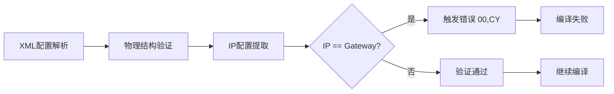

# VCU-CGT-SwUR-0126 技术分析报告
## IP地址与网关相同配置问题分析


---

### 📋 文档元信息

| 项目 | 内容 |
|------|------|
| **文档标识** | VCU-CGT-SwUR-0126-分析报告 |
| **文档类型** | 技术分析报告 |
| **回复人** | 刘浩洋 |
| **创建日期** | 2025-10-10 |

---

### 📑 目录导航

- [1. 需求定义](#1-需求定义)
- [2. 问题概述](#2-问题概述)
- [3. 双层防护机制分析](#3-双层防护机制分析)
  - [3.1 第一层：CGT_B 编译时验证](#31-第一层cgt_b-编译时验证)
  - [3.2 第二层：VCU 平台运行时防护](#32-第二层vcu-平台运行时防护)
- [4. ARP死锁机制深度解析](#4-arp死锁机制深度解析)

---

## 1. 需求定义

### 📋 CGY需求 [VCU-CGT-SwUR-0126]


---

## 2. 问题概述

### 🔍 问题描述

当VCU系统的IP地址与网关地址配置为相同值时，会在网络协议栈的ARP层触发一个严重的死锁机制：

1. **静态网关记录异常**: 系统启动时创建一条"指向自己"的静态ARP记录
2. **MAC地址缺失**: 该静态记录未包含有效的MAC地址映射
3. **ARP查询阻塞**: 所有需要网关转发的数据包在ARP查表时命中该空记录
4. **通信死锁**: 数据包被永久阻塞在重发队列，跨网段通信完全失效

---

## 3. 双层防护机制分析

### 3.1 第一层：CGT_B 编译时验证

#### 🛡️ 设计目标

在配置文件编译阶段（CGT_B工具）拦截错误配置，防止生成包含错误配置的二进制文件。

#### 📊 实现现状分析

> ⚠️ **关键发现**: 经过完整代码审查，发现验证框架已定义但**核心验证逻辑未实现或未找到实现代码**，导致第一层防护当前处于失效状态。

##### 1️⃣ 错误代码定义

**文件位置**: ErrorCodes.cs:48`

```csharp
/// <summary>
/// 错误代码：COM单元回环配置（IP与Gateway相同）
/// </summary>
public const string ConfComCellLoopback = "00,CY";
```

**分析结果**:
- ✅ **定义状态**: 已在错误代码常量中明确定义
- ❌ **实际使用**: 通过全代码库搜索，未发现任何代码引用此错误代码
- ⚠️ **结论**: 错误代码虽已定义，但未实际使用

##### 2️⃣ 验证接口定义

**文件位置**: IBusinessRuleValidationService.cs:15`

```csharp
/// <summary>
/// 业务规则验证服务接口
/// </summary>
public interface IBusinessRuleValidationService
{
    /// <summary>
    /// 检查COM单元无回环配置（确保 IP != Gateway）
    /// </summary>
    /// <returns>验证是否通过</returns>
    bool CheckNoLoopBackComCell();

    // ... 其他业务规则验证方法
}
```

**分析结果**:
- ✅ **接口状态**: 接口方法已明确定义，包含清晰的XML注释
- ❌ **实现状态**: 未找到实现该接口的具体类
- ❌ **调用状态**: 未找到任何代码调用此验证方法
- ⚠️ **结论**: 验证接口定义完整，但缺少实现和集成

##### 3️⃣ 验证流程缺失

**预期验证流程** (未实现):



**实际情况**: 上述验证流程在当前代码库中未找到实现。

#### 🔴 第一层防护结论

| 检查项 | 状态 | 说明 |
|--------|------|------|
| 错误代码定义 | ✅ 完成 | `ConfComCellLoopback` 已定义 |
| 验证接口定义 | ✅ 完成 | `CheckNoLoopBackComCell()` 已定义 |
| 接口实现 | ❌ 缺失 | 未找到实现类 |
| 验证调用 | ❌ 缺失 | 未在编译流程中集成 |
| **综合评估** | 🔴 **失效** | **验证框架虽有设计但未实现，错误配置可通过编译阶段** |

---

### 3.2 第二层：VCU 平台运行时防护

#### 🎯 理论防护机制

理想情况下，即使配置通过编译阶段，VCU运行时平台也应能检测并处理IP与Gateway相同的异常情况。

#### 💥 实际表现：ARP层死锁

> **核心问题机制**: 当网关配置为本机IP时，系统启动时会创建一条"指向自己"的静态ARP网关记录，但此记录缺少有效MAC地址。后续所有需要网关转发的数据包在ARP查表时命中该空记录，导致不再发送新的ARP请求，数据包被永久阻塞在重发队列中，最终造成跨网段通信完全失败。

---

## 4. ARP死锁机制深度解析

> **核心问题**: 把网关配置成和本机IP相同后，启动时生成了一条"指向自己"的静态网关记录，但这条记录没有有效 MAC；因而 ARP 层每次只命中这条空记录，不再发送新的 ARP 请求，结果所有要走网关的报文都卡在待发队列里，最终发不出去。

---

### 1️⃣ 启动阶段：静态网关条目创建

- `VCU_IP_TSK_F_StartAccordingtoConf` 会调用 `GM_PROS_ARP_F_AddStaticEntry(VCU_IP_TSK_V_Management.LocalGatewayIP[x])`
- 该调用最终落到 `GM_PROS_ARP_F_AddEntry(..., IsStatic=TRUE)`，生成 `Dynamic=0`、`arp_type=2` 的静态记录，并未写入有效 MAC

---

### 2️⃣ 发送阶段：ARP 查表被锁死

- `GM_PROS_ETH_F_IpSendProcess` 会先判断目标地址是否等于任一网关，相等时固定走该接口发送
- 之后 `GM_PROS_ETH_F_PackFrame` 调用 `GM_PROS_ARP_F_FindEntry`；命中静态网关记录时函数直接返回 `GM_PROS_C_BASE_PROSTACK`，不会发起新的 ARP 请求
- 报文被放入重发表等待，而静态记录永不刷新，等待队列就此堵死

---

### 3️⃣ 直接后果

| 通信类型 | 影响状态 | 说明 |
|---------|---------|------|
| **跨网段通信** | 🔴 完全失效 | 所有需要通过该网关的报文都无法发出 |
| **同网段通信** | ✅ 正常工作 | 走正常的 ARP 请求流程，不受影响 |

---

### 4️⃣ 实际代码层面的影响

- `GM_PROS_ETH_F_IpSendProcess` 的网关匹配逻辑会强制将数据包路由到错误配置的网关
- `GM_PROS_ARP_F_FindEntry` 在命中静态记录时返回 `GM_PROS_C_BASE_PROSTACK`，不会触发新的 ARP 请求
- `GM_PROS_ETH_F_PackFrame` 收到该返回码后仅把帧放入重发表等待，因此报文不会真正发送

---
